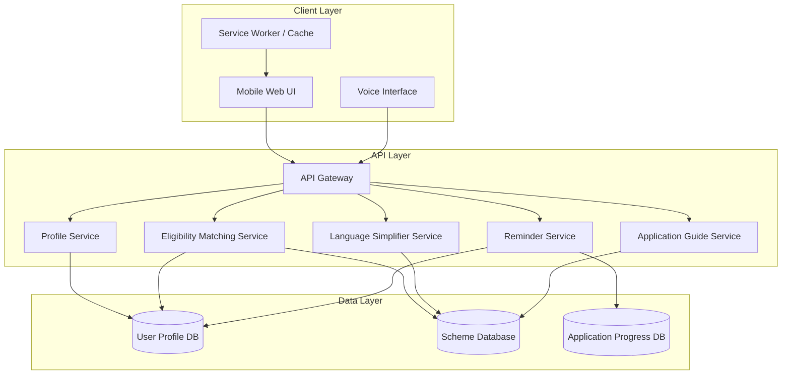

# Design Document: AI Assistant for Public Scheme & Scholarship Access

## Overview

The AI Assistant for Public Scheme & Scholarship Access is a mobile-first web application that helps Indian citizens discover and apply for government schemes and scholarships. The system uses rule-based eligibility matching, natural language processing for text simplification, and progressive web app (PWA) technology to deliver a voice-enabled, low-bandwidth experience.

The architecture follows a three-tier pattern: a lightweight frontend optimized for mobile devices, a backend API layer handling business logic, and a data layer managing scheme information and user profiles. The system prioritizes simplicity, accessibility, and offline-first capabilities to serve users with limited digital literacy and connectivity.

## Architecture

### High-Level Architecture



### Technology Stack Considerations

**Frontend:**
- Progressive Web App (PWA) for offline support and mobile optimization
- Responsive design framework (mobile-first)
- Web Speech API for voice input/output
- IndexedDB for local caching

**Backend:**
- RESTful API design for stateless operations
- JSON for data interchange (lightweight)
- Background job processor for reminders

**Data Storage:**
- Relational database for structured scheme data and user profiles
- Document store optional for flexible scheme metadata

### Design Principles

1. **Mobile-First**: All interfaces designed for small screens first, then scaled up
2. **Offline-First**: Essential functionality works without connectivity
3. **Progressive Enhancement**: Core features work on basic devices, enhanced features on capable devices
4. **Minimal Cognitive Load**: Simple flows, clear language, one task at a time
5. **Accessibility by Default**: WCAG 2.1 AA compliance, keyboard navigation, screen reader support

## Components and Interfaces

### 1. Profile Service

**Responsibility**: Manage user profile creation, validation, and updates.

**Interface:**
```typescript
interface ProfileService {
  createProfile(profileData: UserProfileInput): Result<UserProfile, ValidationError>
  updateProfile(userId: string, updates: Partial<UserProfileInput>): Result<UserProfile, ValidationError>
  getProfile(userId: string): Result<UserProfile, NotFoundError>
  validateProfile(profileData: UserProfileInput): ValidationResult
}

interface UserProfileInput {
  age: number
  educationLevel: EducationLevel
  annualIncome: number
  state: string
  district: string
  socialCategory: SocialCategory
  occupation: string
}

interface ValidationResult {
  isValid: boolean
  missingFields: string[]
  invalidFields: Map<string, string>  // field name -> error message
}
```

**Key Operations:**
- Validate age is positive integer
- Validate income is non-negative
- Validate state and district against known Indian administrative divisions
- Ensure all required fields are present
- Store data usage consent timestamp

### 2. Eligibility Matching Service

**Responsibility**: Analyze user profiles against scheme eligibility criteria and rank matches.

**Interface:**
```typescript
interface EligibilityMatchingService {
  findMatchingSchemes(userId: string): Result<RankedScheme[], Error>
  explainMatch(userId: string, schemeId: string): MatchExplanation
  suggestProfileImprovements(userId: string): ProfileSuggestion[]
}

interface RankedScheme {
  scheme: Scheme
  relevanceScore: number
  matchReasons: string[]
  rankingFactors: RankingFactors
}

interface MatchExplanation {
  schemeId: string
  matchedCriteria: CriteriaMatch[]
  userAttributes: Map<string, any>
}

interface CriteriaMatch {
  criterionName: string
  required: boolean
  userValue: any
  criterionValue: any
  matches: boolean
}

interface RankingFactors {
  benefitAmount: number
  daysUntilDeadline: number
  eligibilityMargin: number  // how much user exceeds minimum requirements
  preferenceWeight: number
}
```

**Matching Algorithm:**
1. Load user profile and all active schemes
2. For each scheme, evaluate all eligibility criteria:
   - Age: user.age >= scheme.minAge && user.age <= scheme.maxAge
   - Income: user.annualIncome <= scheme.maxIncome
   - Education: user.educationLevel meets scheme.minEducation
   - Location: user.state in scheme.eligibleStates && user.district in scheme.eligibleDistricts
   - Category: user.socialCategory in scheme.eligibleCategories
3. Include scheme only if ALL mandatory criteria match
4. Calculate relevance score: `score = (benefitWeight * benefitAmount) + (deadlineWeight * urgency) + (fitWeight * eligibilityMargin)`
5. Sort schemes by relevance score descending
6. Return top N schemes with match explanations

**Performance Target**: Complete matching for 500 schemes in under 3 seconds

### 3. Language Simplifier Service

**Responsibility**: Convert complex policy language into simple, accessible text.

**Interface:**
```typescript
interface LanguageSimplifierService {
  simplifyText(complexText: string, targetLevel: ReadabilityLevel): SimplifiedText
  simplifyEligibilityCriteria(criteria: EligibilityCriteria[]): SimplifiedCriteria[]
  highlightKeyConditions(criteria: SimplifiedCriteria[], maxHighlights: number): SimplifiedCriteria[]
}

interface SimplifiedText {
  originalText: string
  simplifiedText: string
  readabilityScore: number
  replacements: Map<string, string>  // complex term -> simple term
}

interface SimplifiedCriteria {
  originalCriterion: string
  simplifiedCriterion: string
  isHighlighted: boolean
  importance: number
}

enum ReadabilityLevel {
  Grade6 = 6,
  Grade7 = 7,
  Grade8 = 8
}
```

**Simplification Rules:**
1. Replace technical terms with everyday equivalents (dictionary-based)
2. Break sentences longer than 15 words into multiple sentences
3. Convert passive voice to active voice
4. Replace complex sentence structures with simple subject-verb-object patterns
5. Use bullet points for lists instead of comma-separated items
6. Calculate readability using Flesch-Kincaid Grade Level formula
7. Iterate until target readability level achieved (max 3 iterations)

**Term Replacement Dictionary Examples:**
- "domicile" → "permanent resident"
- "annual per capita income" → "yearly income per person"
- "matriculation" → "10th grade completion"
- "beneficiary" → "person who receives benefits"

### 4. Application Guide Service

**Responsibility**: Generate step-by-step application instructions for schemes.

**Interface:**
```typescript
interface ApplicationGuideService {
  generateGuide(schemeId: string, userId: string): ApplicationGuide
  getNextAction(schemeId: string, userId: string): NextAction
}

interface ApplicationGuide {
  schemeId: string
  eligibilitySummary: string
  requiredDocuments: Document[]
  applicationSteps: Step[]
  submissionDetails: SubmissionDetails
  deadline: Date
  commonMistakes: string[]
  nextAction: NextAction
}

interface Document {
  name: string
  commonName: string
  example: string
  isMandatory: boolean
}

interface Step {
  stepNumber: number
  instruction: string
  estimatedTime: string
  tips: string[]
}

interface SubmissionDetails {
  method: string  // "online" | "offline" | "both"
  websiteUrl?: string
  officeAddress?: string
  contactPhone?: string
  contactEmail?: string
}

interface NextAction {
  action: string
  priority: "high" | "medium" | "low"
  deadline?: Date
}
```

**Guide Generation Logic:**
1. Retrieve scheme application process from database
2. Simplify eligibility summary using Language Simplifier
3. Order documents by importance (mandatory first)
4. Sequence steps in correct application order
5. Identify single most important next action based on user's current progress
6. Format all text for voice-friendly output (short sentences)

### 5. Voice Interface Service

**Responsibility**: Handle speech-to-text input and optimize responses for text-to-speech output.

**Interface:**
```typescript
interface VoiceInterfaceService {
  transcribeSpeech(audioData: AudioBuffer): Result<string, TranscriptionError>
  optimizeForSpeech(text: string): string
  handleVoiceCommand(transcript: string, context: UserContext): VoiceResponse
}

interface VoiceResponse {
  spokenText: string
  displayText: string
  action?: string
  data?: any
}

interface UserContext {
  userId: string
  currentScreen: string
  conversationHistory: string[]
}
```

**Voice Optimization Rules:**
1. Limit sentences to 20 words maximum
2. Avoid abbreviations (expand "e.g." to "for example")
3. Spell out numbers under 10, use digits for larger numbers
4. Remove special characters and formatting
5. Add natural pauses with punctuation
6. Provide context before details ("For the scholarship, you need three documents: first...")

**Supported Voice Commands:**
- "Find schemes for me"
- "Tell me about [scheme name]"
- "What documents do I need"
- "Set a reminder"
- "Update my profile"

### 6. Low-Bandwidth Optimization Service

**Responsibility**: Detect connection quality and optimize content delivery.

**Interface:**
```typescript
interface LowBandwidthService {
  detectConnectionSpeed(): ConnectionSpeed
  optimizeResponse(data: any, mode: BandwidthMode): OptimizedResponse
  cacheEssentialData(userId: string): CacheManifest
}

enum ConnectionSpeed {
  Slow2G = "slow-2g",
  TwoG = "2g",
  ThreeG = "3g",
  FourG = "4g"
}

enum BandwidthMode {
  Full = "full",
  Optimized = "optimized",
  Minimal = "minimal"
}

interface OptimizedResponse {
  data: any
  sizeBytes: number
  mode: BandwidthMode
  cachedLocally: boolean
}

interface CacheManifest {
  schemes: string[]  // scheme IDs
  userProfile: boolean
  applicationProgress: boolean
  lastUpdated: Date
}
```

**Optimization Strategies:**
1. **Minimal Mode** (< 2G): Text only, no images, defer non-essential data
2. **Optimized Mode** (2G-3G): Compressed text, lazy load details, essential images only
3. **Full Mode** (4G+): All features, images, real-time updates

**Caching Strategy:**
- Cache user profile locally (IndexedDB)
- Cache top 10 matched schemes for offline viewing
- Cache application guides for schemes user has shown interest in
- Sync changes when connection improves

### 7. Reminder Service

**Responsibility**: Manage deadline reminders and application progress notifications.

**Interface:**
```typescript
interface ReminderService {
  createReminder(userId: string, schemeId: string, deadline: Date): Reminder
  getUpcomingReminders(userId: string): Reminder[]
  sendReminder(reminderId: string): Result<void, Error>
  updateReminder(reminderId: string, updates: Partial<Reminder>): Result<Reminder, Error>
  cancelReminder(reminderId: string): Result<void, Error>
}

interface Reminder {
  id: string
  userId: string
  schemeId: string
  deadline: Date
  reminderDates: Date[]  // 7 days before, 1 day before
  incompleteSteps: string[]
  status: "active" | "sent" | "cancelled"
}
```

**Reminder Logic:**
1. When user expresses interest in scheme, offer reminder creation
2. Calculate reminder dates: deadline - 7 days, deadline - 1 day
3. Background job checks for due reminders every hour
4. Send notification via configured channel (SMS, email, push notification)
5. Include incomplete application steps in reminder message

## Data Models

### User Profile

```typescript
interface UserProfile {
  id: string
  age: number
  educationLevel: EducationLevel
  annualIncome: number
  state: string
  district: string
  socialCategory: SocialCategory
  occupation: string
  createdAt: Date
  updatedAt: Date
  dataConsentGiven: boolean
  dataConsentTimestamp: Date
}

enum EducationLevel {
  BelowPrimary = "below_primary",
  Primary = "primary",           // 1-5
  UpperPrimary = "upper_primary", // 6-8
  Secondary = "secondary",        // 9-10
  HigherSecondary = "higher_secondary", // 11-12
  Undergraduate = "undergraduate",
  Postgraduate = "postgraduate",
  Doctorate = "doctorate"
}

enum SocialCategory {
  General = "general",
  OBC = "obc",
  SC = "sc",
  ST = "st",
  EWS = "ews"
}
```

### Scheme

```typescript
interface Scheme {
  id: string
  name: string
  description: string
  benefitAmount: number
  benefitType: string  // "scholarship", "subsidy", "grant", etc.
  eligibilityCriteria: EligibilityCriteria
  requiredDocuments: DocumentRequirement[]
  applicationProcess: ApplicationProcess
  deadline: Date
  isActive: boolean
  officialSourceUrl: string
  lastUpdated: Date
  targetAudience: string[]
}

interface EligibilityCriteria {
  minAge?: number
  maxAge?: number
  maxIncome?: number
  minEducation?: EducationLevel
  eligibleStates?: string[]
  eligibleDistricts?: string[]
  eligibleCategories?: SocialCategory[]
  additionalCriteria?: Map<string, any>
}

interface DocumentRequirement {
  documentType: string
  commonName: string
  isMandatory: boolean
  example: string
  notes: string
}

interface ApplicationProcess {
  steps: ProcessStep[]
  submissionMethod: "online" | "offline" | "both"
  websiteUrl?: string
  officeAddress?: string
  contactInfo: ContactInfo
  estimatedProcessingTime: string
  commonMistakes: string[]
}

interface ProcessStep {
  stepNumber: number
  description: string
  detailedInstructions: string
  estimatedTime: string
  tips: string[]
}

interface ContactInfo {
  phone?: string
  email?: string
  helplineNumber?: string
}
```

### Application Progress

```typescript
interface ApplicationProgress {
  id: string
  userId: string
  schemeId: string
  status: ApplicationStatus
  completedSteps: number[]
  totalSteps: number
  notes: string[]
  reminderId?: string
  startedAt: Date
  lastUpdatedAt: Date
  submittedAt?: Date
}

enum ApplicationStatus {
  NotStarted = "not_started",
  InProgress = "in_progress",
  Blocked = "blocked",
  Submitted = "submitted",
  Completed = "completed"
}
```

### Search Index

```typescript
interface SearchIndex {
  schemeId: string
  searchableText: string  // concatenation of name, description, keywords
  category: string[]
  benefitType: string
  targetAudience: string[]
}
```

## Correctness Properties

*A property is a characteristic or behavior that should hold true across all valid executions of a system—essentially, a formal statement about what the system should do. Properties serve as the bridge between human-readable specifications and machine-verifiable correctness guarantees.*


### Property 1: Profile Validation Completeness
*For any* user profile submission, if any required field is missing or invalid (negative age, negative income, unknown location), the system should reject the submission and return a list of all validation errors.
**Validates: Requirements 1.2, 1.5**

### Property 2: Profile Update Triggers Re-evaluation
*For any* user profile update, the system should re-run eligibility matching and the set of matched schemes should reflect the updated profile attributes.
**Validates: Requirements 1.3**

### Property 3: Eligibility Matching Correctness
*For any* user profile and scheme database, the eligibility matcher should return only schemes where ALL mandatory criteria are satisfied by the user's profile attributes.
**Validates: Requirements 2.1**

### Property 4: Scheme Ranking Consistency
*For any* set of matched schemes, they should be ranked such that schemes with higher combined scores (based on benefit amount, deadline proximity, and eligibility margin) appear before schemes with lower scores.
**Validates: Requirements 11.1, 11.2, 11.3, 11.5**

### Property 5: Match Explanation Accuracy
*For any* matched scheme, the explanation should reference only the actual user profile attributes that satisfied the scheme's eligibility criteria.
**Validates: Requirements 2.3**

### Property 6: Readability Level Compliance
*For any* text processed by the language simplifier, the output should have a Flesch-Kincaid grade level between 6 and 8.
**Validates: Requirements 3.1**

### Property 7: Term Replacement Consistency
*For any* text containing terms from the replacement dictionary, all occurrences of those terms should be replaced with their simple equivalents in the output.
**Validates: Requirements 3.2**

### Property 8: Sentence Length Constraint
*For any* text simplified by the language simplifier, all sentences should contain 15 words or fewer.
**Validates: Requirements 3.3**

### Property 9: List Formatting for Multiple Conditions
*For any* eligibility criteria with multiple conditions (2 or more), the simplified output should format them as a numbered or bulleted list rather than a paragraph.
**Validates: Requirements 3.4**

### Property 10: Key Condition Highlighting
*For any* scheme with eligibility conditions, the simplifier should highlight exactly 3 conditions (or all conditions if fewer than 3 exist).
**Validates: Requirements 3.5**

### Property 11: Application Steps Sequential Ordering
*For any* application guide, the steps should be numbered sequentially starting from 1, and the step numbers should match the required completion order.
**Validates: Requirements 4.2**

### Property 12: Document Common Naming
*For any* required document in an application guide, the document should be presented using its common name rather than official/technical name.
**Validates: Requirements 4.3**

### Property 13: Single Next Action Identification
*For any* scheme and user application state, the application guide should identify exactly one next action as the highest priority.
**Validates: Requirements 4.4**

### Property 14: Complete Contact Information
*For any* application step that references an external website or office, the guide should include all available contact information (URL, address, phone, email).
**Validates: Requirements 4.5**

### Property 15: Voice and Text Input Equivalence
*For any* input text, whether it originates from voice transcription or keyboard entry, the system should produce identical processing results and outputs.
**Validates: Requirements 5.2**

### Property 16: Voice Response Sentence Length
*For any* response generated in voice mode, all sentences should contain 20 words or fewer.
**Validates: Requirements 5.3**

### Property 17: Voice Ambiguity Handling
*For any* voice input that produces multiple possible interpretations, the system should request clarification rather than proceeding with an arbitrary choice.
**Validates: Requirements 5.5**

### Property 18: Low-Bandwidth Content Restriction
*For any* response delivered in low-bandwidth mode, the response should contain no images or graphics unless explicitly requested by the user.
**Validates: Requirements 6.1**

### Property 19: Automatic Bandwidth Mode Switching
*For any* detected connection speed below 2G, the system should automatically enable low-bandwidth mode.
**Validates: Requirements 6.2**

### Property 20: Offline Scheme Caching
*For any* scheme that a user has viewed, that scheme's data should be available in local cache for offline access.
**Validates: Requirements 6.3**

### Property 21: Progressive Content Loading
*For any* scheme list display, basic information (name, benefit amount, deadline) should load before detailed content (full description, application steps).
**Validates: Requirements 6.4**

### Property 22: Payload Size Limit
*For any* page delivered in low-bandwidth mode, the total payload size should not exceed 50KB.
**Validates: Requirements 6.5**

### Property 23: Reminder Offer on Interest
*For any* scheme with a deadline, when a user expresses interest (views details, saves, or starts application), the system should offer to create a reminder.
**Validates: Requirements 7.1**

### Property 24: Deadline Reminder Timing
*For any* active reminder, the system should send notifications at 7 days before deadline and 24 hours before deadline.
**Validates: Requirements 7.2, 7.3**

### Property 25: Incomplete Steps in Reminders
*For any* reminder notification where the user has incomplete application steps, those specific incomplete steps should be included in the reminder message.
**Validates: Requirements 7.4**

### Property 26: Reminder CRUD Operations
*For any* reminder, the user should be able to view its details, modify its settings, and cancel it.
**Validates: Requirements 7.5**

### Property 27: Match Disclaimer Presence
*For any* display of matched schemes, a disclaimer should be present explaining that matching is AI-based and users should verify with official sources.
**Validates: Requirements 8.3**

### Property 28: Demo Data Labeling
*For any* scheme or data marked as demo/synthetic, it should be clearly labeled as non-official demonstration data in the UI.
**Validates: Requirements 8.5**

### Property 29: Responsive Design Range
*For any* screen width between 320px and 1920px, all UI elements should render correctly without horizontal scrolling or content cutoff.
**Validates: Requirements 9.1**

### Property 30: Touch Target Minimum Size
*For any* interactive element (button, link, input field), the touch target area should be at least 44x44 pixels.
**Validates: Requirements 9.2**

### Property 31: Mobile Single-Column Layout
*For any* viewport width below 768px, content should be presented in a single-column layout.
**Validates: Requirements 9.3**

### Property 32: Navigation State Preservation
*For any* navigation action between screens, the previous screen's scroll position and form input values should be preserved for back navigation.
**Validates: Requirements 9.4**

### Property 33: Scheme Data Model Completeness
*For any* scheme stored in the database, all required fields (name, description, eligibility criteria, benefit amount, application process, required documents, deadline, official source URL) should be present and non-null.
**Validates: Requirements 10.1**

### Property 34: Scheme Validation on Save
*For any* scheme add or update operation, the system should validate that all required fields are present and properly formatted before saving.
**Validates: Requirements 10.2**

### Property 35: Expired Scheme Exclusion
*For any* scheme whose deadline has passed, it should be marked as inactive and excluded from eligibility matching results.
**Validates: Requirements 10.4**

### Property 36: Scheme Freshness Tracking
*For any* scheme, a last update timestamp should be stored and displayed to users when viewing scheme details.
**Validates: Requirements 10.5**

### Property 37: Ranking Score Explanation
*For any* ranked scheme in match results, an explanation should be provided showing which factors (benefit amount, deadline, eligibility margin, preferences) influenced its ranking position.
**Validates: Requirements 11.4**

### Property 38: Text Alternative Presence
*For any* non-text content (image, icon, graphic), a text alternative (alt text, aria-label, or equivalent) should be present.
**Validates: Requirements 12.1**

### Property 39: Keyboard Accessibility
*For any* interactive element, it should be reachable via keyboard navigation (Tab key) and operable via keyboard (Enter/Space), with a visible focus indicator.
**Validates: Requirements 12.2**

### Property 40: Color Contrast Compliance
*For any* text element, the contrast ratio between text and background should be at least 4.5:1 for normal text or 3:1 for large text (18pt+).
**Validates: Requirements 12.3**

### Property 41: Heading Hierarchy Correctness
*For any* page, heading elements should follow proper hierarchy (h1 → h2 → h3) without skipping levels.
**Validates: Requirements 12.4**

### Property 42: Form Error Association
*For any* form field with a validation error, the error message should be programmatically associated with the field (via aria-describedby or equivalent).
**Validates: Requirements 12.5**

### Property 43: Search Query Matching
*For any* search query, returned schemes should only include those where the query text matches the scheme name, description, or benefit type (case-insensitive).
**Validates: Requirements 13.1**

### Property 44: Category Filter Accuracy
*For any* category filter selection, returned schemes should only include those belonging to the selected category.
**Validates: Requirements 13.2**

### Property 45: Search Result Eligibility Indication
*For any* scheme in search results, an indicator should be displayed showing whether the current user meets eligibility requirements.
**Validates: Requirements 13.3**

### Property 46: Autocomplete Suggestion Provision
*For any* partial search input of 2 or more characters, the system should provide autocomplete suggestions based on scheme names and categories.
**Validates: Requirements 13.4**

### Property 47: Initial Application Status
*For any* newly created application progress record, the initial status should be set to "Not Started".
**Validates: Requirements 14.1**

### Property 48: Application Step Status Transitions
*For any* application step, the user should be able to transition its status to "complete", "in-progress", or "blocked".
**Validates: Requirements 14.2**

### Property 49: Application Completion Calculation
*For any* saved application, the displayed completion percentage should equal (number of completed steps / total steps) × 100.
**Validates: Requirements 14.3**

### Property 50: Notes and Reminders Attachment
*For any* application step, the user should be able to attach text notes and link reminders to that specific step.
**Validates: Requirements 14.4**

### Property 51: Submitted Application Relocation
*For any* application marked as complete/submitted, it should be moved from the "In Progress" section to the "Submitted" section while maintaining deadline tracking.
**Validates: Requirements 14.5**

## Error Handling

### Input Validation Errors

**Profile Validation:**
- Invalid age (negative, zero, or unrealistic values > 120): Return error "Please enter a valid age between 1 and 120"
- Invalid income (negative): Return error "Income cannot be negative. Enter 0 if no income."
- Unknown location: Return error "Please select a valid state and district from the list"
- Missing required fields: Return error listing all missing fields by name

**Scheme Search Errors:**
- Empty search query: Prompt user with "Please enter a search term"
- No results found: Display "No schemes found. Try different keywords or browse by category"
- Invalid filter combination: Display available schemes with message "No schemes match all selected filters"

### System Errors

**Database Connection Failures:**
- Display: "Unable to connect. Please check your internet connection and try again."
- Enable offline mode if cached data is available
- Retry connection automatically every 30 seconds

**Eligibility Matching Timeout:**
- If matching exceeds 5 seconds: Display "Taking longer than expected. Please wait..."
- If matching exceeds 10 seconds: Return partial results with message "Showing partial results. Some schemes may not be included."

**Voice Recognition Errors:**
- Low confidence transcription: Ask "Did you say [transcription]? Please confirm or try again."
- No speech detected: Display "No speech detected. Please try again."
- Unsupported language: Display "Voice input currently supports English only. Please use text input or switch language."

### Data Integrity Errors

**Scheme Data Issues:**
- Missing required fields: Log error, exclude scheme from results, notify administrators
- Invalid deadline format: Attempt to parse common formats, log error if unable
- Corrupted eligibility criteria: Exclude scheme from matching, display in search with warning "Eligibility information unavailable"

**Cache Synchronization Errors:**
- Stale cached data: Display data age "Last updated: X days ago" and offer refresh
- Cache corruption: Clear corrupted cache, reload from server
- Cache storage full: Remove least recently used items, notify user if offline access is limited

## Testing Strategy

### Unit Testing Approach

Unit tests will focus on specific examples, edge cases, and error conditions for individual components:

**Profile Service:**
- Test valid profile creation with all required fields
- Test profile validation with missing fields
- Test profile validation with invalid data types
- Test profile update and retrieval
- Test edge cases: age boundaries (0, 1, 120, 121), income boundaries (0, negative)

**Eligibility Matching Service:**
- Test matching with single criterion (age only, income only, etc.)
- Test matching with multiple criteria
- Test edge case: user exactly at threshold (age = minAge, income = maxIncome)
- Test edge case: empty scheme database
- Test edge case: profile matches zero schemes
- Test ranking with equal scores
- Test ranking with different factor combinations

**Language Simplifier Service:**
- Test term replacement with known dictionary entries
- Test sentence splitting for long sentences
- Test readability calculation
- Test edge case: already simple text (no changes needed)
- Test edge case: text with no dictionary terms
- Test list formatting with 2, 3, 5 conditions

**Application Guide Service:**
- Test guide generation for complete scheme data
- Test guide generation with missing optional fields
- Test next action identification for different application states
- Test edge case: scheme with no required documents
- Test edge case: scheme with 1 application step

**Voice Interface Service:**
- Test voice command parsing for known commands
- Test response optimization (sentence splitting, abbreviation expansion)
- Test edge case: empty input
- Test edge case: very long input (> 500 words)

**Low-Bandwidth Service:**
- Test connection speed detection
- Test mode switching at thresholds
- Test payload size calculation
- Test cache operations (store, retrieve, evict)
- Test edge case: cache full scenario

**Reminder Service:**
- Test reminder creation with valid deadline
- Test reminder date calculation (7 days, 1 day before)
- Test reminder retrieval for user
- Test reminder cancellation
- Test edge case: deadline in past
- Test edge case: deadline today

### Property-Based Testing Approach

Property-based tests will verify universal properties across randomly generated inputs. Each test should run a minimum of 100 iterations.

**Test Configuration:**
- Use a property-based testing library appropriate for the implementation language (e.g., Hypothesis for Python, fast-check for TypeScript/JavaScript, QuickCheck for Haskell)
- Configure each property test to run 100+ iterations
- Tag each test with: **Feature: public-scheme-assistant, Property {number}: {property title}**

**Generator Strategies:**

*User Profile Generator:*
- Generate random age (1-120)
- Generate random income (0-10,000,000)
- Select random state and district from valid lists
- Select random education level and social category from enums
- Generate random occupation string

*Scheme Generator:*
- Generate random eligibility criteria with various combinations
- Generate random benefit amounts (1,000-1,000,000)
- Generate random deadlines (past, present, future)
- Generate random application processes with 1-10 steps
- Generate random document requirements (0-15 documents)

*Text Generator:*
- Generate random sentences with varying lengths (5-50 words)
- Generate text with and without technical terms
- Generate text with multiple conditions (2-10)

**Property Test Examples:**

```
Property 1: Profile Validation Completeness
- Generate random incomplete profiles (missing 1-5 fields)
- Generate random invalid profiles (negative age, negative income, invalid location)
- Assert: validation returns errors for all issues
- Tag: Feature: public-scheme-assistant, Property 1: Profile Validation Completeness

Property 3: Eligibility Matching Correctness
- Generate random user profile
- Generate random scheme database (10-100 schemes)
- Run eligibility matching
- For each returned scheme, assert: user meets ALL mandatory criteria
- For each non-returned scheme, assert: user fails at least one mandatory criterion
- Tag: Feature: public-scheme-assistant, Property 3: Eligibility Matching Correctness

Property 6: Readability Level Compliance
- Generate random complex text (grade level 10-16)
- Run language simplifier
- Calculate Flesch-Kincaid grade level of output
- Assert: grade level is between 6 and 8
- Tag: Feature: public-scheme-assistant, Property 6: Readability Level Compliance

Property 8: Sentence Length Constraint
- Generate random text with varying sentence lengths
- Run language simplifier
- Split output into sentences
- Assert: all sentences have ≤ 15 words
- Tag: Feature: public-scheme-assistant, Property 8: Sentence Length Constraint

Property 22: Payload Size Limit
- Generate random scheme data
- Render in low-bandwidth mode
- Calculate payload size
- Assert: size ≤ 50KB
- Tag: Feature: public-scheme-assistant, Property 22: Payload Size Limit

Property 29: Responsive Design Range
- Generate random viewport width (320-1920)
- Render UI at that width
- Assert: no horizontal scrolling, no content cutoff
- Tag: Feature: public-scheme-assistant, Property 29: Responsive Design Range

Property 43: Search Query Matching
- Generate random scheme database
- Generate random search query
- Run search
- For each result, assert: query matches name OR description OR benefit type
- Tag: Feature: public-scheme-assistant, Property 43: Search Query Matching
```

### Integration Testing

Integration tests will verify end-to-end flows:

- Complete user journey: profile creation → scheme matching → view guide → set reminder
- Search flow: enter query → filter results → view scheme details
- Application tracking flow: start application → mark steps complete → submit
- Voice interaction flow: voice input → transcription → processing → voice response
- Offline flow: view schemes online → go offline → access cached schemes

### Accessibility Testing

- Automated accessibility testing using tools like axe-core or Pa11y
- Manual keyboard navigation testing
- Manual screen reader testing (NVDA, JAWS, VoiceOver)
- Color contrast verification using automated tools
- Focus indicator visibility testing

### Performance Testing

- Eligibility matching performance: measure time for 100, 500, 1000 schemes
- Page load time in different bandwidth modes
- Cache performance: measure cache hit rates and retrieval times
- Voice transcription latency
- Search query response time

### Usability Testing

- Test with target users (students, rural citizens, first-generation digital users)
- Measure task completion rates for key flows
- Gather feedback on language simplicity and clarity
- Test voice interface with various accents
- Test on actual low-bandwidth connections (2G, 3G)

### Test Data

**Synthetic Scheme Database:**
- Create 100-500 synthetic schemes covering various categories
- Include schemes with different eligibility criteria combinations
- Include schemes with various deadline scenarios (past, near future, far future)
- Label all test data as "Demo Data - Not Official"

**Test User Profiles:**
- Create diverse test profiles representing target user segments
- Include edge case profiles (minimum age, maximum age, zero income, high income)
- Include profiles that match many schemes and profiles that match few schemes

### Continuous Testing

- Run unit tests on every code commit
- Run property tests nightly (due to longer execution time)
- Run integration tests before each deployment
- Run accessibility tests weekly
- Monitor production errors and add regression tests for discovered issues
